# DIDNOW

 <p align="center">
 	
	<a href="https://github.com/codestates/BEB-05-DIDNOW/search?l=JavaScript&type=code"></a>
	<a href="https://github.com/codestates/BEB-05-DIDNOW/graphs/contributors"></a>
	<a href="https://github.com/codestates/BEB-05-DIDNOW/stargazers"></a>
	<a href="https://github.com/codestates/BEB-05-DIDNOW/network/members"></a>
  <a href="https://github.com/codestates/BEB-05-DIDNOW/blob/master/LICENSE"></a><br/>
  <a href="https://github.com/codestates/BEB-05-DIDNOW/actions/workflows/deploy.yml"></a>
  <a href="https://github.com/codestates/BEB-05-DIDNOW/issues?q=is%3Aissue+is%3Aclosed"></a>
  <a href="https://github.com/codestates/BEB-05-DIDNOW/milestones"></a>
</p>

## :rocket: 배포링크 : https://didnow.cf/
## :movie_camera: 발표영상 : https://youtu.be/G_nWCWi55kE

# :books: 목차

- [:book: 프로젝트 소개](#book-프로젝트-소개)
  - [프로젝트 개요](#프로젝트-개요)
  - [프로젝트 요약](#프로젝트-요약)
  - [프로젝트 플로우차트](#프로젝트-플로우차트)
  - [DB 스키마](#db-스키마)
- [:electric_plug: 컴퓨터 구성 / 필수 조건 안내 (Prerequisites)](#electric_plug-컴퓨터-구성--필수-조건-안내-prerequisites)
- [:wrench: 사용 기술 (Technique)](#wrench-사용-기술-technique)

  - [:hammer:기술 스택 (Technique Used)](#기술-스택-technique-used)
    - [**FrontEnd**](#frontend)
    - [**BackEnd**](#backend)
    - [**Smart Contract**](#smart-contract)
    - [**Deploy**](#deploy)
  - [:construction:Architecture](#construction-architecture)
  - [:earth_asia:Network](#earth_asia-networ)

    - [Deploy :rocket:](#deploy-rocket)
    - [Connect](#connect)

  - [퍼블릭 블록체인을 활용한 DID](#퍼블릭-블록체인을-활용한-did)
    - [DID란?](#did란)
    - [퍼블릭 블록체인?](#퍼블릭-블록체인)

- [:floppy_disk: 설치 & 시작 안내 (Installation Process & Getting Start)](#floppydisk-설치--시작-안내-installation-process--getting-start)
- [:computer: 제공 기능 (Service)](#computer-제공-기능-service)
  - [Commen](#common)
  - [Holder](#holder)
  - [Issuer](#issuer)
  - [Verifier](#verifier)
- [:family: 팀 정보 (Team Information)](#family-팀-정보-team-information)

# :book: 프로젝트 소개

## 프로젝트 개요

인증서 발급 기관은 많은 유저의 인증서를 직접 발급해줘야 하고, 유저가 인증서를 재요청하는 경우 복잡한 행정절차를 따라야 했다. 인증서를 발급받은 유저는 인증서를 직접 관리해야 했고, 인증서를 검증하는 기관은 인증서의 위,변조 여부를 정확히 판별할 수 있는 방법이 없었다.
이러한 사회적 문제를 해결하기 위해 우리는 블록체인을 활용한 인증서 관리 플랫폼 DIDNOW를 개발하였다.

## 프로젝트 요약

- 위,변조 불가능한 인증서
- 인증서 통합 관리 서비스

## 프로젝트 플로우차트

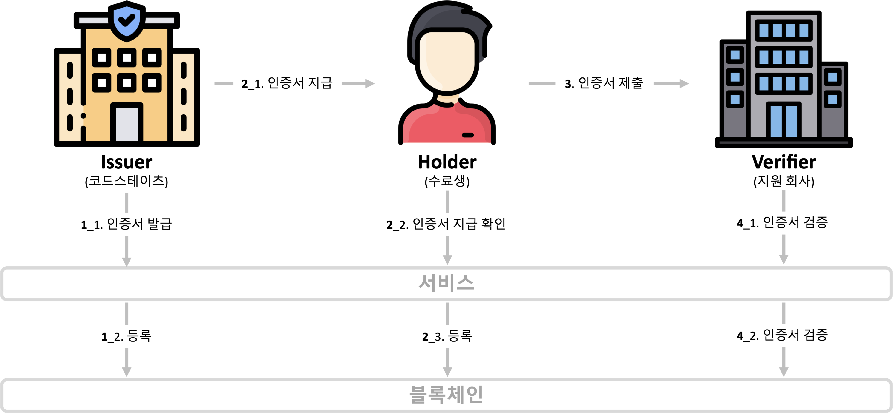

## DB 스키마

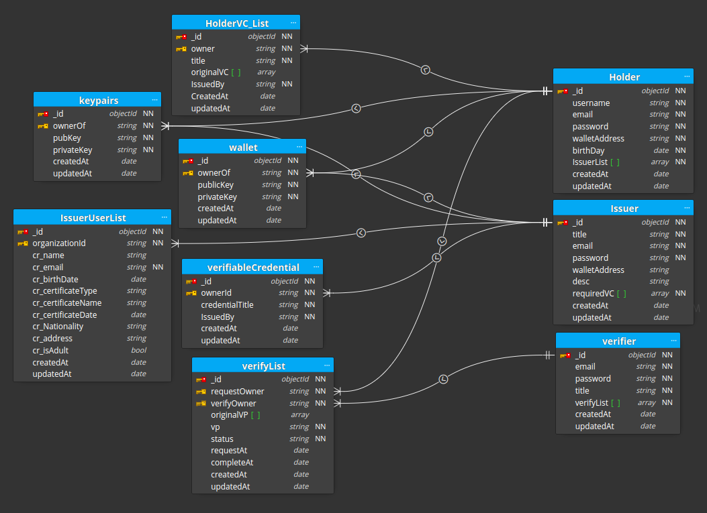

# :wrench: 사용 기술 (Technique)

## :hammer:기술 스택 (Technique Used)

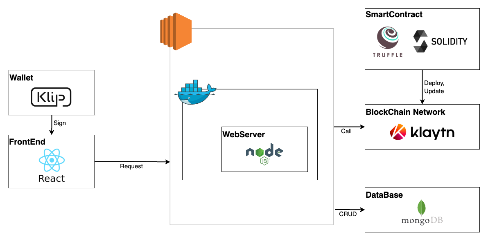
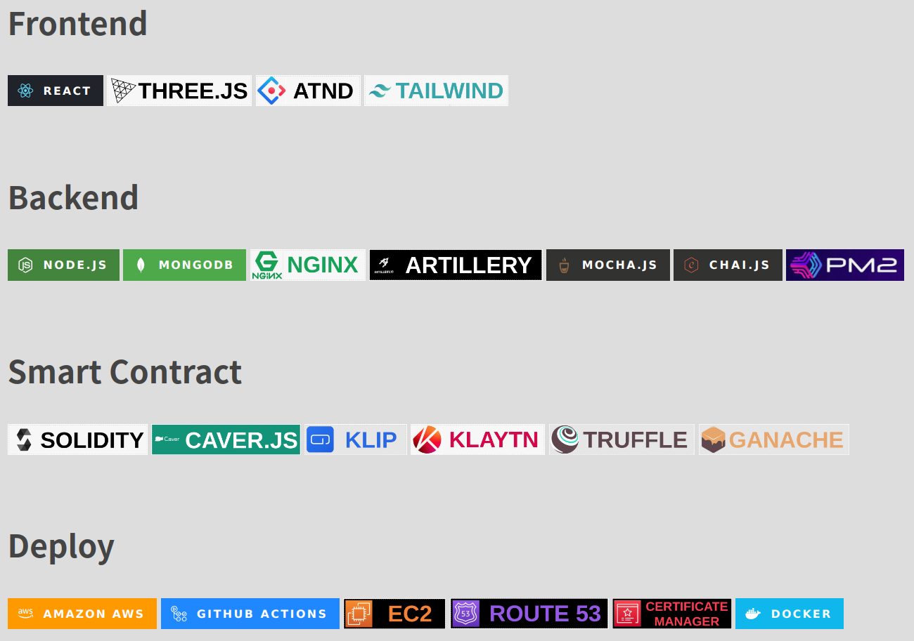

### FrontEnd

|                             Icon                             |  Stack   | Description     |
| :----------------------------------------------------------: | :------: | --------------- |
|     |  REACT   | 프론트앤드 구성 |
|      |   ANTD   | 컴포넌트 UI     |
|  | TAILWIND | 컴포넌트 UI     |
|   | THREEJS  | 런칭 페이지     |

### BackEnd

|                             Icon                              |   Stack   | Description                                      |
| :-----------------------------------------------------------: | :-------: | ------------------------------------------------ |
|     |  NODEJS   | API 서버 4대 제작                                |
|    |  MONGODB  | MongoDB Atlas M0 사용                            |
|      |   NGINX   | Load Balancing과 static 파일 반환 웹 서버로 사용 |
|  | ARTILLERY | HTTP 프로토콜 부하 테스트 진행시 사용            |
|      |   MOCHA   | Unit Test에 사용                                 |
|       |   CHAI    | Unit Test Assert Library 사용                    |

### Smart Contract

|                             Icon                             |  Stack   | Description          |
| :----------------------------------------------------------: | :------: | -------------------- |
|  | SOLIDITY | 스마트 컨트랙트 작성 |
|   | TRUFFLE  | 스마트 컨트랙트 배포 |
|    |  KLAYTN  | 블록체인 네트워크    |
|      |   KLIP   | 지갑 연동            |
|   | GANACHE  | 로컬에서 테스트      |

### Deploy

|                               Icon                                |        Stack        | Description                        |
| :---------------------------------------------------------------: | :-----------------: | ---------------------------------- |
|         |       DOCKER        | 컨테이너 생성, 배포 시 이미지 생성 |
|      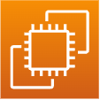      |         EC2         | 배포 서버                          |
|        |      ROUTE 53       | DNS와 EC2서버 연결                 |
|            | CERTIFICATE MANAGER | SSL 인증서 생성                    |
|  |   GITHUB ACTIONS    | CI/CI 배포 자동화 사용             |

## :construction:Architecture

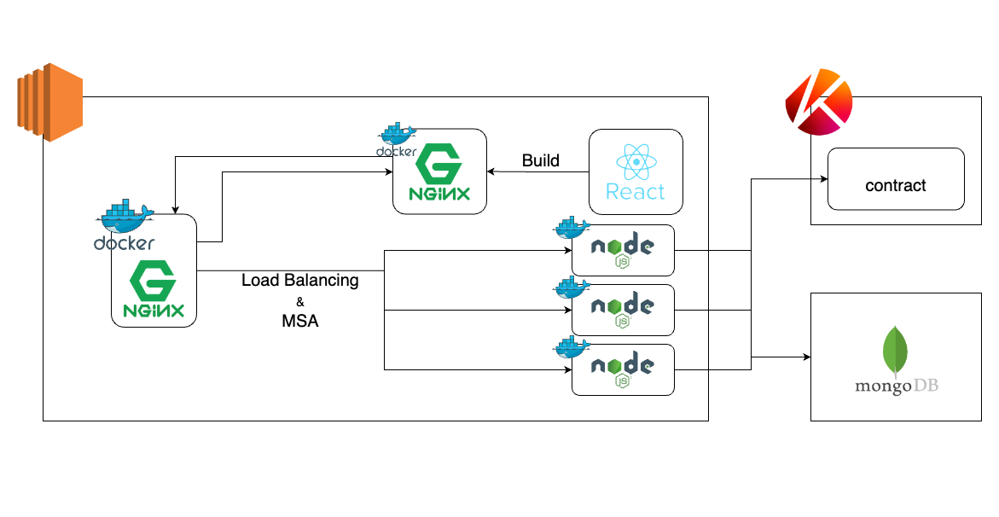

1. Docker를 사용하여 Proxy, Front, Back을 따로 빌드하고 실행. 이 때 Front는 react를 빌드하여 생성된 html파일을 NginX에 담아 빌드하여 메모리를 절약한다.
2. Proxy를 구성하고 있는 NginX는 URL로 접속한 유저를 Front로 링크해주고 Front에서 발생한 API Request를 적절한 Back 서버 중 트래픽이 가장 적은 서버로 연결시킨다.
3. Back 서버는 요청에 따라 Klaytn 네트워크와 MongoDB를 호출하여 기능을 실행한다.

## :earth_asia:Network

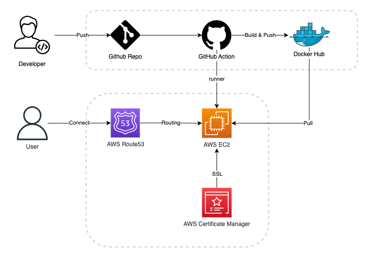

### Deploy :rocket:

1. 개발자가 지정된 Repository의 지정된 Branch에 Push하면 GuthubAction이 실행되어 Docker파일로 빌드하고 DockerHub에 Push한다.
2. 그 후 GithubAction은 EC2에서 실행중인 Runner를 호출해 DockerHub에서 이미지를 Pull하고 실행한다.

### Connect

1. 유저가 URL에 접속하면 AWS Route53을 통해 해당 도메인이 EC2인스턴스와 연결된다.
2. Certificate Manager에서 발급된 인증서를 이용해 해당 도메인 주소에 대한 SSL 인증을 확인하고 https 연결을 승인한다.

## 퍼블릭 블록체인을 활용한 DID

### DID란?

Decentralized Identity(탈중앙 신원증명, DID)는 데이터의 주권을 개개인에게 부여하고 중앙화된 제3자를 거치지 않고 인증에 성공할 수 있는 차세대 인증 방식입니다.

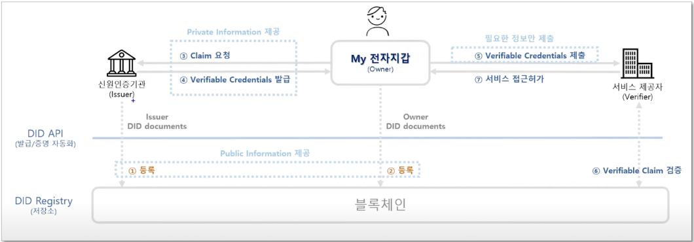

### Why public Blockchain?

- DID를 구현한 대부분의 서비스들은 컨소시엄 블록체인을 사용합니다.
- 하지만 위의 경우 중앙화된 네트워크로 100% 분산화된 블록체인이라고 할 수는 없습니다.
- 중앙화된 블록체인은 결국 소수의 권력자에 의해 데이터 위변조의 위험이 도사리고 있습니다.
- **DIDNOW**는 위임 지분 증명(DPoS)를 사용한 Klaytn public Blockchain을 활용한 DID 서비스를 구현함으로써 **100% 탈중앙화된 블록체인** 위에서 작동합니다.

### Flowchart


### VP 검증과정

#### 1. Holder의 디지털 서명 확인

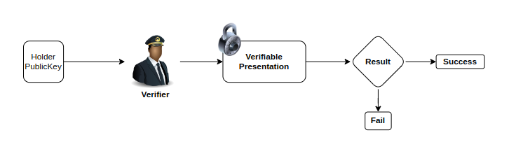

#### 2. Issuer의 디지털 서명 복호화

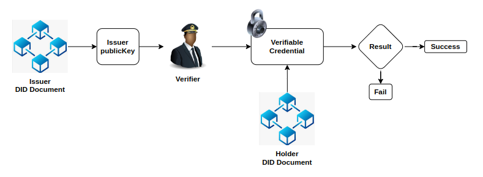

#### 3. Issuer DID Document에서 Holder ID 확인


#### 4. Verifier가 검증할 인증서의 종류 확인


# :floppy_disk: 설치 & 시작 안내 (Installation Process & Getting Start)

## 1. FE .env 설정

`FE/client/.env.development`내용을 그대로 복사해 .env를 생성한다.

## 2. BE .env 설정

`BE/01_AUTH-server/.env.example`, `BE/02_ISSUER-server/.env.example`, `BE/03_HOLDER-server/.env.example`, `BE/04_VERIFIER-server/.env.example`를 참고해 각각 .env파일을 생성한다.

## 3. default.conf 생성

`$IP`에 자신이 접속한 IP를 입력하여 default.conf 파일을 생성합니다.

```shell
cd Proxy
echo url=$IP | cat - githubaction > githubaction.sh
chmod 777 githubaction.sh
./githubaction.sh
rm ./githubaction.sh
cd ..
```

## 4. docker-compose 실행

docker-compose파일을 실행하여 localhost:80에 접속하여 테스트해볼 수 있습니다.

```shell
docker-compose up -d
```

# :computer: 제공 기능 (Service)

## Common

|                     회원가입                     |
| :----------------------------------------------: |
|  |

## Holder

|                     인증서 발급                     |                      인증서 다운로드                      |
| :-------------------------------------------------: | :-------------------------------------------------------: |
| 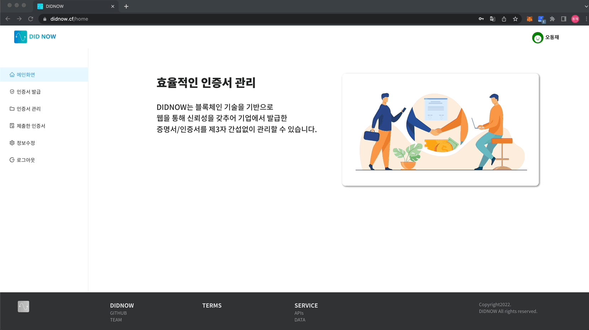 |  |

|                       인증서 제출                       |                    인증서 제출 목록                     |
| :-----------------------------------------------------: | :-----------------------------------------------------: |
| 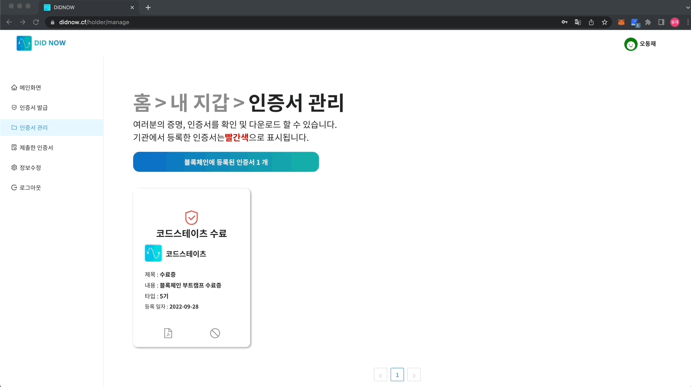 |  |

## Issuer

|                      인증서 제작                      |                      인증서 지급                      |
| :---------------------------------------------------: | :---------------------------------------------------: |
| 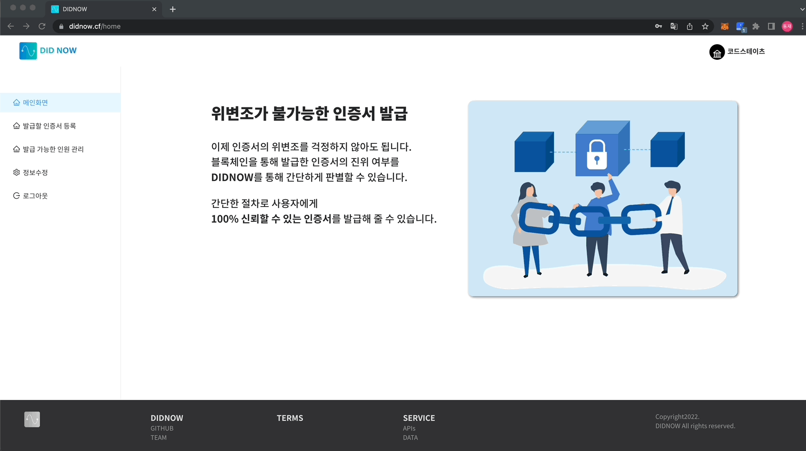 | 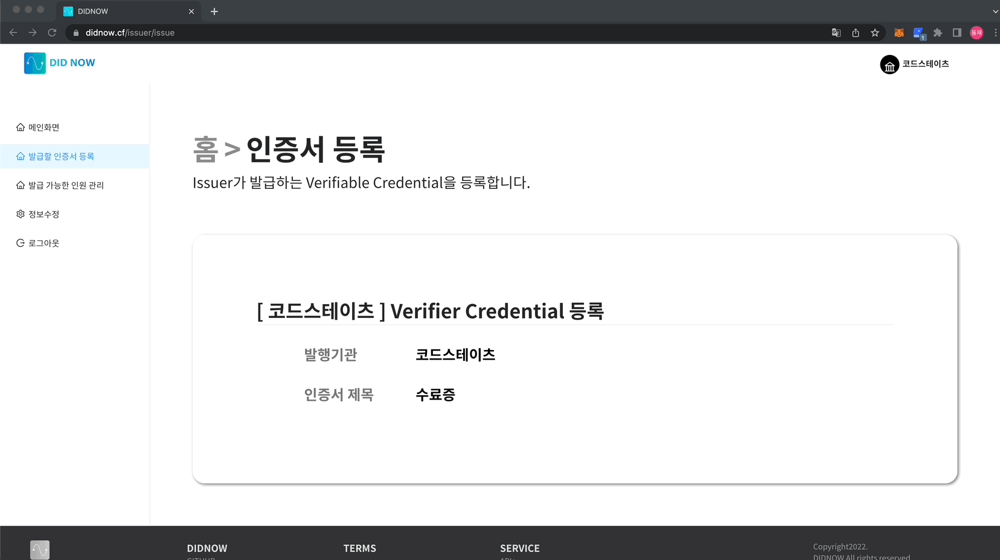 |

## Verifier

|                        인증서 검증                       |
| :-------------------------------------------------------: |
| 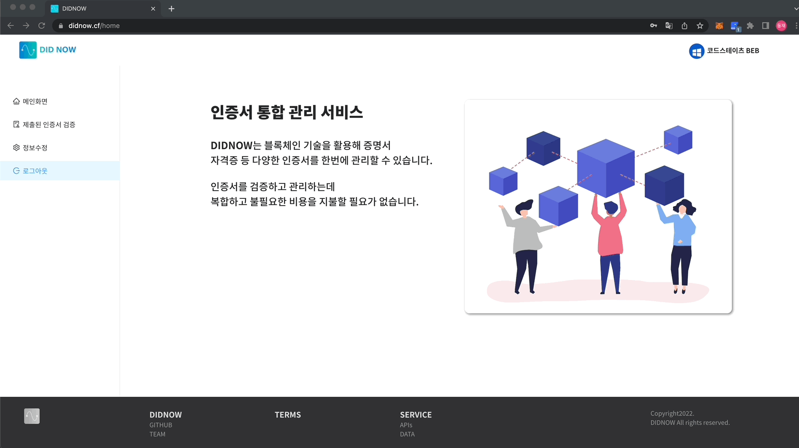 |

# :family: 팀 정보 (Team Information)

<h6 align="center">(팀원 정렬 순서는 이름순입니다.)</h6>

| name   | role          | GitHub                                                                                                                            |
| ------ | ------------- | --------------------------------------------------------------------------------------------------------------------------------- |
| 안병현 | Front-end     | <a href="https://github.com/qudgus9601"></a>   |
| 오동재 | SmartContract | <a href="https://github.com/donggni0712"></a> |
| 허윤석 | Back-end      | <a href="https://github.com/ysheokorea"></a>   |
