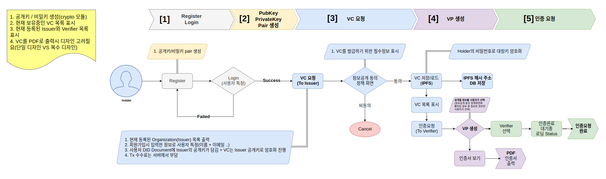
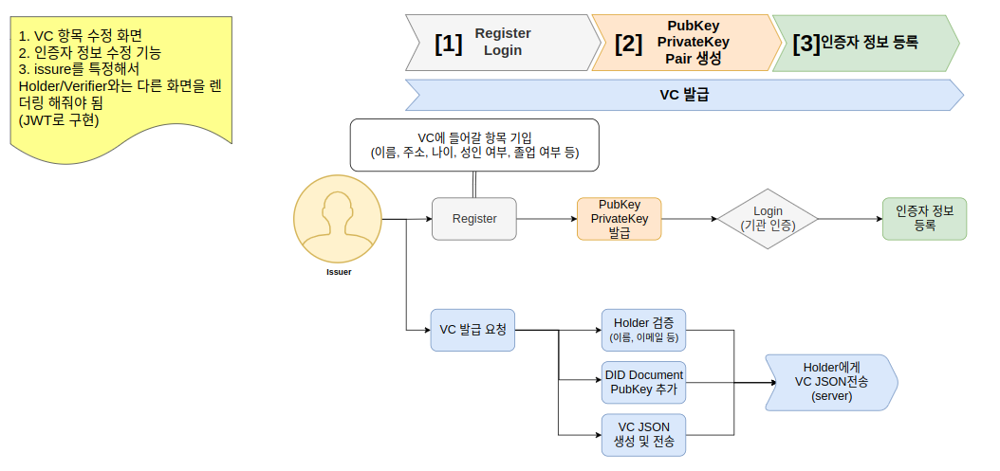

# DIDNOW

 <p align="center">
 	
	<a href="https://github.com/codestates/BEB-05-DIDNOW/search?l=JavaScript&type=code"></a>
	<a href="https://github.com/codestates/BEB-05-DIDNOW/graphs/contributors"></a>
	<a href="https://github.com/codestates/BEB-05-DIDNOW/stargazers"></a>
	<a href="https://github.com/codestates/BEB-05-DIDNOW/network/members"></a>
	<a href="https://github.com/codestates/BEB-05-DIDNOW/blob/master/LICENSE"></a>
  </p>

# :book: 프로젝트 소개

## 프로젝트 개요

인증서 발급 기관은 많은 유저의 인증서를 직접 발급해줘야 하고, 유저가 인증서를 재요청하는 경우 복잡한 행정절차를 따라야 했다. 인증서를 발급받은 유저는 인증서를 직접 관리해야 했고, 인증서를 검증하는 기관은 인증서의 위,변조 여부를 정확히 판별할 수 있는 방법이 없었다.
이러한 사회적 문제를 해결하기 위해 우리는 블록체인을 활용한 인증서 관리 플랫폼 DIDNOW를 개발하였다.

## 프로젝트 요약

- 위,변조 불가능한 인증서
- 인증서 통합 관리 서비스

# :electric_plug: 컴퓨터 구성 / 필수 조건 안내 (Prerequisites)

- ECMAScript 6 지원 브라우저 사용
- 권장: Google Chrome 버젼 77 이상

# :wrench: 사용 기술 (Technique)

## :hammer:기술 스택 (Technique Used)


### FrontEnd

|                             Icon                             |  Stack   | Description |
| :----------------------------------------------------------: | :------: | ----------- |
|     |  REACT   |             |
|      |   ANTD   |             |
|  | TAILWIND |             |
|   | THREEJS  |             |

### BackEnd

|                            Icon                             |  Stack  | Description |
| :---------------------------------------------------------: | :-----: | ----------- |
|   | NODEJS  |             |
|  | MONGODB |             |
|    |  NGINX  |             |

### Smart Contract

|                             Icon                             |  Stack   | Description |
| :----------------------------------------------------------: | :------: | ----------- |
|  | SOLIDITY |             |
|   | TRUFFLE  |             |
|    |  KLAYTN  |             |
|      |   KLIP   |             |
|   | GANACHE  |             |

### Deploy

|                            Icon                             |        Stack        | Description |
| :---------------------------------------------------------: | :-----------------: | ----------- |
|   |       DOCKER        |             |
|      |         EC2         |             |
|  |      ROUTE 53       |             |
|      | CERTIFICATE MANAGER |             |

## :construction:Architecture


1. Docker를 사용하여 Proxy, Front, Back을 따로 빌드하고 실행. 이 때 Front는 react를 빌드하여 생성된 html파일을 NginX에 담아 빌드하여 메모리를 절약한다.
2. Proxy를 구성하고 있는 NginX는 URL로 접속한 유저를 Front로 링크해주고 Front에서 발생한 API Request를 적절한 Back 서버 중 트래픽이 가장 적은 서버로 연결시킨다.
3. Back 서버는 요청에 따라 Klaytn 네트워크와 MongoDB를 호출하여 기능을 실행한다.

## :earth_asia:Network


### Deploy :rocket:

1. 개발자가 지정된 Repository의 지정된 Branch에 Push하면 GuthubAction이 실행되어 Docker파일로 빌드하고 DockerHub에 Push한다.
2. 그 후 GithubAction은 EC2에서 실행중인 Runner를 호출해 DockerHub에서 이미지를 Pull하고 실행한다.

### Connect

1. 유저가 URL에 접속하면 AWS Route53을 통해 해당 도메인이 EC2인스턴스와 연결된다.
2. Certificate Manager에서 발급된 인증서를 이용해 해당 도메인 주소에 대한 SSL 인증을 확인하고 https 연결을 승인한다.

## 퍼블릭 블록체인을 활용한 DID

### DID란?

### 왜 DID인가?

### 퍼블릭 블록체인?





# :floppy_disk: 설치 & 시작 안내 (Installation Process & Getting Start)

## 1. default.conf 생성

`$IP`에 자신이 접속한 IP를 입력하여 default.conf 파일을 생성합니다.

```shell
cd Proxy
echo url=$IP | cat - githubaction > githubaction.sh
chmod 777 githubaction.sh
./githubaction.sh
rm ./githubaction.sh
cd ..
```

## 2. docker-compose 실행

docker-compose파일을 실행하여 localhost:80에 접속하여 테스트해볼 수 있습니다.

```shell
docker-compose up -d
```

# :computer: 제공 기능 (Service)

- 작성 예정

# :family: 팀 정보 (Team Information)

<h6 align="center">(팀원 정렬 순서는 이름순입니다.)</h6>

| name   | role          | GitHub                                                                                                                              |
| ------ | ------------- | ----------------------------------------------------------------------------------------------------------------------------------- |
| 박찬우 | Front-end     | <a href="https://github.com/tonynotmorty"></a> |
| 안병현 | Front-end     | <a href="https://github.com/qudgus9601"></a>     |
| 오동재 | SmartContract | <a href="https://github.com/donggni0712"></a>   |
| 허윤석 | Back-end      | <a href="https://github.com/ysheokorea"></a>     |
