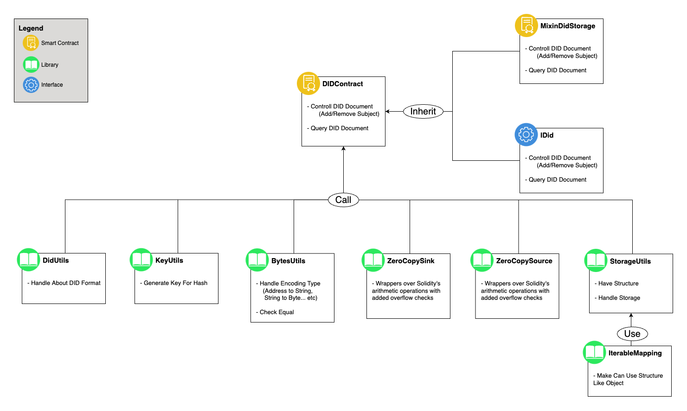

# Smart Contract

## DIDContract

- **contract abi** : [DID_Contract abi](./contracts/abi/DIDContractABI.json)
- **contract address** : 0x9BdC1344b8B3773D6d79ed9e254825FE30B217f4
- **contract scope** : https://baobab.scope.klaytn.com/account/0x9BdC1344b8B3773D6d79ed9e254825FE30B217f4?tabId=internalTx
- **method**
  |Function Name|Parameter|Description|
  |:--:|:--|:--|
  |getDocument|()|DID Document 문서를 불러옵니다.|
  |addService|(did, serviceId, pemPubKey)|인증서를 발급하고 검증할 수 있는 값을 추가합니다.|
  |getAllService|(did)|서비스 목록을 불러옵니다.|

### **Method** 사용 예시

#### - getDocument

`getDocument()`로 호출

#### - addService

`addService('did:klay:7423de10c75b1d4d1f30a4d81386e3aaf22584f9','00-1234-5678','adsdy37#ihad#*E!hsdads09-_asd_ads-amv')`adsdy...로 복호화가능한 일련번호 00-1234-5678의 인증서를 발급한 후 DID에 등록해 후에 검증가능하게 함.

- did 양식은 'did:klay:publicKey'를 준수.
- publicKey는 0x를 제외한 40자리

#### - getAllService

`getAllService('did:klay:7423de10c75b1d4d1f30a4d81386e3aaf22584f9')`로 해당 did가 소유하고 있는 서비스 목록 전체 출력 가능

## SmartContract Archetecture

## Proxy Model

### Eternal Storage Model

### References

- https://klaytn-tech.medium.com/caver-contract%EB%A5%BC-%EC%82%AC%EC%9A%A9%ED%95%98%EC%97%AC-%EC%88%98%EC%88%98%EB%A3%8C%EB%A5%BC-%EB%8C%80%EB%82%A9%ED%95%B4%EB%B3%B4%EC%9E%90-4c046900c4ed
- https://github.com/ontology-tech/DID-solidity
- https://blog.openzeppelin.com/proxy-patterns/
